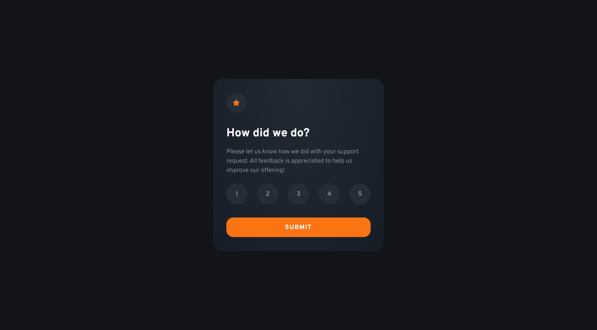

# Interactive rating component

This is an interactive rating componet project made by using React framework

## Table of contents

- [Overview](#overview)
  - [The challenge](#the-challenge)
  - [Screenshot](#screenshot)
  - [Links](#links)
- [My process](#my-process)
  - [Built with](#built-with)
  - [What I learned](#what-i-learned)
  - [Continued development](#continued-development)
  - [Useful resources](#useful-resources)
- [Author](#author)
- [Acknowledgments](#acknowledgments)

## Overview

### The challenge

Users should be able to:

- View the optimal layout for the app depending on their device's screen size
- See hover states for all interactive elements on the page
- Select and submit a number rating
- See the "Thank you" card state after submitting a rating

### Screenshot

### Links

- Solution URL: [Github repository](https://github.com/Luka-khokhashvili/interactive-rating-component.git)
- Live Site URL: [Vercel live project](https://interactive-rating-component-ten-beta.vercel.app)

## My process

### Built with

- Semantic HTML5 markup
- CSS custom classes
- Flexbox
- Responsive desings
- [React](https://reactjs.org/) - JS library

## Author

- Portfolio - [Luka khokhashvili](https://luka-khokhashvili.github.io/Portfolio/)
- GitHub - [@luka-khokhashvili](https://github.com/Luka-khokhashvili)
- LinkedIn - [@luka-khokhashvili](https://www.linkedin.com/in/luka-khokhashvili-8179b7285/)
